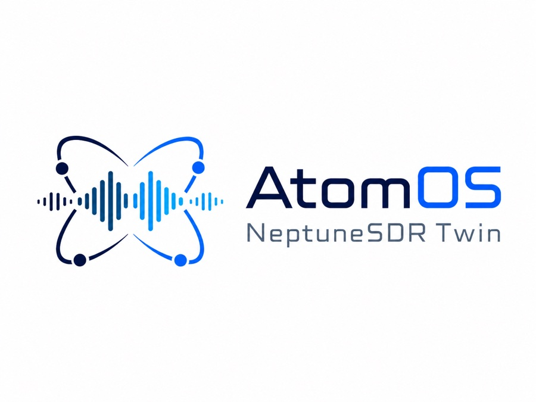

<p align="center"></p>

# AtomOS NeptuneSDR Twin

AtomOS NeptuneSDR Twin is a firmware-executing, contract-driven digital twin
of the advertised HAMGEEK P210 / NeptuneSDR platform. Its P210-enabled QEMU
machine runs ARM instructions from the public P210 Linux kernel/device tree
against board-visible AD9361 SPI, CF-AXI ADC/DDS, four-entry AXI-DMAC, dual
Cortex-A9, GEM, DDR, interrupt, and proposed PL FFT contacts. The released ARM
`iiod` and official host libiio operate across that machine; a second reference
layer supplies deterministic continuous RF/PL behavior, a standard USB/IP
composite device, executable contact-composition checks, and golden vectors.

The tested wideband path is real software integration, not a zero-filled or
userspace-only demo: Linux IIO captures nonzero 2x2 IQ through the ADI drivers
and AXI-DMAC, ARM copies each completed block into the FFT block's reserved DDR
window, starts a 65,536-point two-channel integer FFT through MMIO/DMA, and
transmits two CRC-checked NSFT spectra over the emulated GEM/TCP network
contact at a configured 61.44 MSPS / 50 MHz RX profile. The physical target is
Gigabit Ethernet; the virtual link's negotiated line rate is not used as
throughput evidence.

The pre-arrival appliance is complete at its declared software-visible
contacts; it does not need the purchased board to run. Two provenance
boundaries remain non-negotiable. No complete vendor P210 rootfs was
published with the public kernel, so the executable userspace is the separately
hash-locked official Pluto v0.39 rootfs; this is not a claim that it is the
seller-shipped image. Physical PCB/RF response, oscillator/power behavior, and
a deployable FFT RTL build's XC7Z020 resource/timing closure are calibration or
physical-implementation evidence, not virtual functionality. See the
[complete virtual appliance](docs/VIRTUAL_APPLIANCE.md) and
[evidence/provenance boundary](docs/EVIDENCE.md).

## Two-repository boundary

This repository is the **Twin** half. It owns the QEMU machine and devices,
the deterministic reference models, USB/network emulation, host-side clients,
contract composition, and end-to-end verification. The public companion
[`Atom-NeptuneSDR-Firmware`](https://github.com/PhysicistJohn/Atom-NeptuneSDR-Firmware)
owns the ARM program source, firmware input locks and hostile-input audit,
fetch/build tooling, rootfs composition, firmware-specific tests, and the
canonical [P210 FFT ABI](https://github.com/PhysicistJohn/Atom-NeptuneSDR-Firmware/blob/main/docs/P210_FFT_ABI.md).
Neither repository imports the other's implementation; they meet at Firmware's
versioned JSON interface and generated runtime manifest.
The `Firmware` spelling in the repository and directory name is intentional.

The Twin pins the companion repository by URL, full commit, tree, and interface
SHA-256 in `deps/firmware.lock.json`. The resolver
uses `../Atom-NeptuneSDR-Firmware` when that exact clean checkout matches the
lock. Set `NEPTUNESDR_FIRMWARE_ROOT` for another location. If neither exists,
the resolver clones only the pinned commit into the Twin-owned
`.cache/deps/firmware/`; it never updates, checks out, cleans, or otherwise
mutates a user-managed checkout. Inspect the decision with:

```sh
python3 scripts/resolve_firmware.py --json
```

Use `--offline` to prohibit that managed fetch. A mismatched origin, revision,
tree, interface hash, or dirty checkout fails closed. Full acceptance records
and verifies both Git identities and all emitted runtime hashes.

## Run the whole appliance

One command owns the firmware VM and native-USB bridge as one lifecycle:

```sh
scripts/run_virtual_appliance.sh
```

It waits for both released guest `iiod` and the ARM FFT service, exports the
observed composite personality over USB/IP, prints `NEPTUNE_APPLIANCE READY`,
and tears every process down together on Ctrl-C. Use `--no-build` after the
first build. The default USB/IP listener is loopback-only; pass
`--usbip-host 0.0.0.0` only for a trusted remote Linux client.

For the fast deterministic layer (consecutive 2x2 sample time, retune-atomic
averaging, explicit lag, and bounded no-silent-drop backpressure), run:

```sh
neptune-twin appliance
```

That local appliance exposes IIOD TCP, paired NSFT TCP and the same USB/IP
composite target. Its default profile is 61.44 MSPS, 50 MHz RX bandwidth and a
65,536-point two-channel FFT. Run `neptune-twin appliance --dry-run` to inspect
the resolved contacts without opening listeners.

## Run the firmware-executing hardware twin now

On Apple Silicon macOS, the default command builds the pinned P210-enabled
QEMU 10.0.2 machine, asks the locked Firmware checkout to build the ARM FFT
service and compose only hash-locked inputs, boots two Cortex-A9 CPUs, and exits
only after it receives and
CRC-checks a complete two-channel 65,536-bin spectrum:

```sh
scripts/run_p210_firmware.sh
```

The first run needs Xcode Command Line Tools, `curl`, `tar`, and network access;
it builds the native QEMU and ARM toolchains below `.cache/` and does not install
or flash anything. Later runs reuse that cache. The boot/capture phase is
bounded; initial downloads and compilation are not governed by `--timeout`.
A passing acceptance run ends with `P210_RUNTIME PASS` and retains its serial
log, NSFT wire capture, and decoded report below `.cache/p210-runtime/`.

To reproduce every reference, protocol, co-simulation, locked-artifact, XSA and
firmware gate in one run:

```sh
scripts/accept_virtual_twin.sh
```

It exits with `NEPTUNE_TWIN_ACCEPTANCE PASS` and retains its reports below
`.cache/acceptance/runs/`. A passing full run contains a machine-readable
manifest bound to both exact Git source states, the Firmware interface and
runtime manifest, QEMU binary, compile database, test sets, firmware log, and
runtime artifact hashes; no skipped test is allowed.
`--no-build` reuses verified compiled toolchains. `--source-only` runs the fast
gate with its exact, named set of 15 live-QEMU skips (`--reference-only` remains
a deprecated alias).

For a persistent development target, leave the VM running in one terminal:

```sh
scripts/run_p210_firmware.sh --serve
```

Then, in another terminal, use the real guest services:

```sh
scripts/build_host_libiio.sh
scripts/host_iio.sh info
scripts/capture_guest_fft.py
```

The forwarded endpoints are `ip:127.0.0.1:30431` for released `iiod`,
`tcp:127.0.0.1:30432` for the ARM-generated NSFT spectrum stream, and
`tcp:127.0.0.1:30433` for the live UART1 console (also retained in the serial
log). An optional loopback QEMU debug endpoint is enabled only with
`--gdb PORT`; it is never exposed by default. See
[Pinned host libiio workflow](docs/HOST_LIBIIO.md) and the
[canonical Firmware FFT register/DMA ABI](https://github.com/PhysicistJohn/Atom-NeptuneSDR-Firmware/blob/main/docs/P210_FFT_ABI.md).

The FFT service permits one active spectrum client. A client that stops reading
is evicted after a two-second send deadline so a queued client can proceed.
Changes to the RX LO, sample rate, or RF bandwidth made through `iiod` are
snapshotted around each block; packets carry the actual stable center/sample
metadata and an incrementing configuration epoch rather than boot-time
constants.

This is the firmware-executing layer of the pre-arrival target. It runs the
public P210 kernel and device tree with the official Pluto v0.39 ARM rootfs because no complete
seller P210 rootfs is public. It therefore confirms that composition, not the
unknown bytes that will arrive in the unit. Ethernet/IIO/block-FFT are exercised
end to end. This firmware harness restarts an IIO buffer and copies one complete
block through the CPU per update. The composed continuous reference-PL layer
separately proves uninterrupted sample indices, epoch-atomic retunes and
bounded backpressure; it reports wall-clock lag instead of pretending the
dependency-free Python FFT runs at RF rate. USB device enumeration is supplied
through the standard USB/IP adapter. Physical RF response and FPGA
synthesis/timing remain physical evidence, not blockers to the virtual target.

## Contract/reference model

Python 3.9 or newer is required. The reference layer has no third-party Python
dependencies. The source gate also reads language-neutral vectors from a
sibling `../Atom-DSP` checkout; set `ATOM_DSP_ROOT` when it lives elsewhere.
The same gate resolves and tests the exact Firmware revision as described
above; a source-only run still binds both source trees.

```sh
python3 -m venv .venv
. .venv/bin/activate
python -m pip install --upgrade pip
python -m pip install -e .
scripts/check.sh
```

The wheel/sdist is the dependency-free Python reference and protocol layer.
The QEMU integration, launchers, and complete acceptance matrix are Twin
repository assets. The ARM service and firmware composition are Firmware
assets. Run the two-repository appliance from a Git checkout rather than
treating either Python wheel as the whole system.

Inspect the resolved target, contract composition, 50 MHz rate budget, and reference USB profile:

```sh
neptune-twin info
neptune-twin contracts
neptune-twin wideband
neptune-twin fft-plan
neptune-twin usb
neptune-twin snapshot --boot-source sd --output evidence/twin-snapshot.json
```

Every command is also available as `python -m neptunesdr_twin ...`.

Run the local IIOD endpoint, or inspect the action without opening a listener:

```sh
neptune-twin serve --dry-run
neptune-twin serve --host 127.0.0.1 --port 30431
iio_info -u ip:127.0.0.1
```

The server is a behavioral conformance endpoint, not a promise that every command in every libiio release is implemented. Its supported command and buffer behavior is locked by the test suite. The firmware appliance separately runs released ARM `iiod` 0.26.

Firmware and PL handoff inputs are owned by Firmware, content-addressed, and
inspected without a board. Resolve the locked checkout and invoke its CLI;
these commands never flash a board:

```sh
FIRMWARE_ROOT=$(python3 scripts/resolve_firmware.py)
FIRMWARE_CACHE="$FIRMWARE_ROOT/.cache/firmware"
export PYTHONPATH="$FIRMWARE_ROOT/src${PYTHONPATH:+:$PYTHONPATH}"
python3 -m neptunesdr_firmware validate-locks
python3 -m neptunesdr_firmware fetch \
  p210-sd-boot p210-system-xsa plutosdr-fw-v0.39 \
  --cache-dir "$FIRMWARE_CACHE"
python3 -m neptunesdr_firmware validate-xsa \
  --artifact p210-system-xsa --cache-dir "$FIRMWARE_CACHE"
```

Firmware can assemble the complete non-flashable QEMU-development bundle or
run its narrower bounded boot harness:

```sh
ZIG=/path/to/zig-0.14.1 "$FIRMWARE_ROOT/scripts/build_bundle.sh"
python3 "$FIRMWARE_ROOT/scripts/test_firmware.py" \
  --cache-dir "$FIRMWARE_CACHE" --json

# Dry-run: extract and print the network/monitor-disabled QEMU command.
python3 "$FIRMWARE_ROOT/scripts/qemu_boot.py" --artifact p210-sd-boot \
  --cache-dir "$FIRMWARE_CACHE"

# Execution is opt-in and requires qemu-system-arm.
python3 "$FIRMWARE_ROOT/scripts/qemu_boot.py" --artifact p210-sd-boot \
  --cache-dir "$FIRMWARE_CACHE" --run
```

That bounded `qemu_boot.py` harness remains intentionally narrow: its P210
result is `kernel-entry-only` because the public P210 bundle has no rootfs, and
its stock Pluto result is `kernel-and-initramfs-entry`. The separate
P210-enabled runtime described above is what executes the AD9361/CF-AXI/DMAC,
real IIO/IIOD, Ethernet, and proposed FFT contacts. Neither path executes the
public FPGA bitstream. USB/IP supplies host enumeration at the USB protocol
contact without claiming an emulated electrical PHY.

## What is modeled

| Surface | Implemented behavior | Exactness status |
| --- | --- | --- |
| Contract system | Typed contacts, assume/guarantee composition, domain entailment, fail-closed seam validation, and per-guarantee evidence metadata | Executable and tested |
| Zynq-7020 | QEMU ARMv7 execution, two Cortex-A9s, 512 MiB DDR, SLCR secondary release, GEM and P210 PL address map; plus a fast Python contract model | Functional/instruction accurate enough for the pinned Linux path; not cycle/timing accurate |
| AD9361 | QEMU SPI identity, calibration side effects and clock/status contacts consumed by the real ADI 4.14 driver; Python ENSM/RF control oracle | Real-driver E3 integration; silicon/RF edge cases remain capture-driven |
| RF/sample plane | Real guest IIO/ADI buffer path with deterministic phase-continuous IQ16LE 2x2 tones and four-entry DMAC; richer Python noise/gain/loopback model | Digital packing/DMA proven; analog impairments require E5 calibration |
| On-chip spectrum path | Real QEMU MMIO/DDR accelerator executing deterministic integer radix-2 FFTs through 65,536×2; ARM NSFT-v1 packetizer/host CRC decoder; continuous reference PL runtime with consecutive 2x2 sample indices, retune epochs and bounded backpressure | Firmware-visible E3 block runtime plus E2 continuous contact semantics; deployable RTL synthesis/post-route evidence remains physical work |
| IIO/IIOD | Unmodified P210 ADI kernel drivers and released ARM `iiod` 0.26 reached by pinned official host libiio; separate behavioral conformance endpoint | Network/control/buffer integration proven against the composition; purchased-unit differential testing pending |
| USB | Standard USB/IP device export with byte-locked descriptors/EP0, three native-IIO bulk pairs, optional released-guest bridge, RNDIS DHCP/ARP/ICMP and TCP-IIOD at 192.168.2.1, read-only FAT12 mass storage and CDC ACM; configfs deployment plan | Complete virtual USB protocol contact; QEMU's public P210 DT remains honestly host-mode and physical revision capture remains E4 work |
| Debug | Live UART1 TCP console with simultaneous evidence log; opt-in loopback GDB remote target | Usable virtual UART/JTAG-class development contacts without inventing the revision-unknown physical USB bridge identity |
| Firmware/PL artifacts | Hash-locked public P210 kernel/DT/XSA and official Pluto v0.39 rootfs; ELF/ABI audit, derived initramfs, source-built QEMU runtime | Provenance-preserving composition, not seller-authored full firmware, signed replacement, or bitstream execution |
| Throughput | Separate internal, USB 2.0, Gigabit Ethernet and advertised host-rate contracts | Arithmetic is exact; delivered-unit throughput is unmeasured |

The decomposition, and why contacts (not internal implementation resemblance) define equivalence, are described in [Architecture](docs/ARCHITECTURE.md).

## The 50 MHz requirement

The AD9361 data sheet supports a tunable channel bandwidth up to 56 MHz, so a 50 MHz analog configuration is plausible. That does **not** mean the board can continuously move raw 50 MHz-wide, two-channel IQ to a host.

At 61.44 MSPS with two channels and native 16-bit I/Q containers, the raw payload is 491.52 MB/s (3.932 Gb/s). That is above both USB 2.0’s 60 MB/s signaling ceiling and Gigabit Ethernet’s 125 MB/s line-rate ceiling before protocol overhead. The listing’s “12 MSPS with HOST” and “61.44 MSPS burst” claims are therefore treated separately. Continuous wideband work must process, trigger, decimate, or channelize in the FPGA and use bounded burst capture for undecimated IQ.

The default architecture budget is a 65,536-bin, two-channel on-chip FFT at 61.44 MSPS. Rate-limiting/averaging to at most 20 spectrum updates/s and emitting 16-bit log-power bins in framed `NSFT` version 1 packets (network byte order with CRC32) reduces full-spectrum egress to roughly 5.24 MB/s. `neptune-twin fft-plan` proves that declared arithmetic/contact budget. The continuous reference PL runtime executes this exact averaging/dataflow convention with no silent drops and explicit wall-clock lag. The ARM acceptance service exercises the firmware-visible accelerator one block at a time. A deployable Vivado implementation still needs a direct sample path, synthesis, resource, CDC and post-route timing evidence.

The composed twin can publish the same self-framing NSFT byte stream over TCP with `NeptuneSDRTwin.start_spectrum_publisher()` and decode arbitrary TCP chunks with `SpectrumStreamDecoder`. The tested virtual path is the dedicated spectrum TCP contact and the intended primary deployed path is physical Gigabit Ethernet. The current narrow USB-RNDIS model carries IIOD only; it does not silently claim an NSFT proxy. TCP is deliberate: a full 65,536-bin packet, especially in float32, does not fit in one UDP datagram.

Read [50 MHz wideband plan](docs/WIDEBAND_50MHZ.md) before buying test gear or designing around this bandwidth.

## Capture the delivered unit first

The capture script only inventories host USB state, IIO metadata, and an optional fixed set of read-only SSH facts. It does not stream samples, enable TX, enter DFU, dump flash, or write device attributes.

```sh
./scripts/capture_unit.sh --output evidence/captures/arrival

./scripts/capture_unit.sh \
  --output evidence/captures/arrival-network \
  --iio-uri ip:pluto.local
```

SSH capture is opt-in. The default is noninteractive and requires an already trusted host key and key-based authentication:

```sh
./scripts/capture_unit.sh \
  --output evidence/captures/arrival-ssh \
  --iio-uri ip:pluto.local \
  --ssh-host root@pluto.local
```

For a new host key or password prompt, add the corresponding explicit options shown by `./scripts/capture_unit.sh --help`. Captures contain serial numbers, MAC addresses, hostnames, and network configuration; review them before publishing.

Follow [Arrival checklist](docs/ARRIVAL_CHECKLIST.md) and request the vendor
sources using [Firmware's prepared email](https://github.com/PhysicistJohn/Atom-NeptuneSDR-Firmware/blob/main/scripts/request_vendor_materials.md)
before changing firmware.

## Exactness boundary

“Exact” is scoped per contact and per guarantee:

- Deterministic contacts can be byte-exact after normalization: USB descriptors, SPI transactions, IIO schemas, sample packing, boot artifacts and state traces.
- Timed contacts can be trace-equivalent within a stated tolerance: reset, enumeration, calibration, DMA and boot sequencing.
- RF contacts can only be metric- or distribution-equivalent over a declared frequency, gain, temperature and power envelope.
- Manufacturing details, undocumented silicon behavior, enclosure geometry, oscillator error and RF matching are not inferred from a product title.

Current listing conflicts are retained rather than hidden. In particular, the product page says both 512 MB and 1 GB DDR and a 766 MHz CPU, while the pinned public P210 XSA configures 512 MiB-class 16-bit DDR and a 666.666687 MHz Cortex-A9 clock. A third-party P210 field report also found an AD9363-marked unit despite the current listing saying AD9361. This model resolves CPU/DDR toward the public XSA and AD9361 toward the purchased SKU description while requiring delivered-unit confirmation.

Unit conventions are explicit: a byte is 8 bits; the external DDR data bus/transfer word is 16 bits (2 bytes); each I or Q converter component has 12 significant bits in a signed 16-bit container; and one complex I/Q sample occupies 4 bytes per enabled channel. The public XSA’s four 16-bit RX packer lanes form a 64-bit DMA word for one two-channel sample-time frame. “16-bit DDR” is a memory-bus width, not ADC precision or DMA width.

## USB device testing

`neptune-twin usbip-serve` exports the modeled composite device to a standard
Linux USB/IP client and can bridge native IIO to released guest `iiod`.
[`scripts/linux_usb_gadget.sh`](scripts/linux_usb_gadget.sh) remains the separate
plan for binding the same functions to a machine with a physical Linux USB
Device Controller; without `--apply` it changes nothing. See
[USB behavior and deployment](docs/USB.md).

## Project map

- [`specs/contracts.json`](specs/contracts.json): decomposed contact contracts and evidence thresholds.
- [`src/neptunesdr_twin/data/p210.json`](src/neptunesdr_twin/data/p210.json): resolved target facts, conflicts and unknowns.
- [`src/neptunesdr_twin/data/usb-p210-observed.json`](src/neptunesdr_twin/data/usb-p210-observed.json): byte-locked reference USB fixture.
- `deps/firmware.lock.json`, [`scripts/resolve_firmware.py`](scripts/resolve_firmware.py): immutable companion-repository identity and fail-closed sibling/environment/managed-cache resolver.
- [`Atom-NeptuneSDR-Firmware`](https://github.com/PhysicistJohn/Atom-NeptuneSDR-Firmware): ARM source, input locks, artifact audit/build, non-flashable rootfs composition, canonical interface/FFT ABI, and firmware tests.
- [`scripts/run_p210_firmware.sh`](scripts/run_p210_firmware.sh): one-command bounded firmware/IIO/DMA/FFT/NSFT acceptance run or persistent development VM.
- [`scripts/run_virtual_appliance.sh`](scripts/run_virtual_appliance.sh): lifecycle wrapper for the firmware VM plus native-USB/IIOD bridge.
- [`scripts/accept_virtual_twin.sh`](scripts/accept_virtual_twin.sh): one-command full acceptance matrix and retained reports.
- [`scripts/build_p210_qemu.sh`](scripts/build_p210_qemu.sh), [`qemu/patches/0001-p210-zynq-devices.patch`](qemu/patches/0001-p210-zynq-devices.patch): pinned native QEMU build and P210 Zynq machine integration.
- [`src/neptunesdr_twin/pl_runtime.py`](src/neptunesdr_twin/pl_runtime.py): continuous consecutive-sample 2x2 FFT/averaging/NSFT runtime.
- [`src/neptunesdr_twin/usbip.py`](src/neptunesdr_twin/usbip.py): USB/IP composite device and released-guest native-IIO bridge.
- [`cosim/qemu-10.0.2`](cosim/qemu-10.0.2): AD9361, CF-AXI, four-entry AXI-DMAC, and FFT device implementations.
- [`tests`](tests): executable behavior and regression contracts.
- [`docs/ARCHITECTURE.md`](docs/ARCHITECTURE.md): decomposition and contract theory.
- [`docs/EVIDENCE.md`](docs/EVIDENCE.md): evidence ladder, sources and conflicts.
- [Firmware `docs/P210_FFT_ABI.md`](https://github.com/PhysicistJohn/Atom-NeptuneSDR-Firmware/blob/main/docs/P210_FFT_ABI.md): canonical ARM-visible FFT register and DMA contract.
- [`docs/HOST_LIBIIO.md`](docs/HOST_LIBIIO.md): pinned official host-client workflow.
- [`docs/RUNTIME_ACCEPTANCE.md`](docs/RUNTIME_ACCEPTANCE.md): hard end-to-end gates, deterministic vector, accepted diagnostics, and physical-deployment boundary.
- [`docs/WIDEBAND_50MHZ.md`](docs/WIDEBAND_50MHZ.md): bandwidth/throughput math and RF test plan.
- [`docs/USB.md`](docs/USB.md): reference personalities, host access and gadget limitations.
- [`docs/VIRTUAL_APPLIANCE.md`](docs/VIRTUAL_APPLIANCE.md): completion definition, launch paths and physical-evidence boundary.
- [`docs/UPSTREAM.md`](docs/UPSTREAM.md): which fixes stay local and the gate for proposing a generic upstream change.

## Safety

Keep first-arrival work RX-only. Do not connect a TX port directly to an RX port, do not transmit into an antenna during bench validation, and do not exceed the conservative input envelope in the contracts. Use a 50-ohm conducted setup, rated attenuators, a dummy load, and independently verified power levels. Operation must comply with the radio rules applicable at the test location.

This project does not automatically flash firmware or claim vendor authorization to use Analog Devices’ USB VID on a redistributed product.

## Part of the AtomOS suite

This repository is part of the AtomOS repository suite:

- [Atom-Atomizer](https://github.com/PhysicistJohn/Atom-Atomizer): AI-native spectrum analyzer application.
- [Atom-Classifier](https://github.com/PhysicistJohn/Atom-Classifier): deployed local embedding classifier plus retained Bayesian RF research pipeline.
- [Atom-DSP](https://github.com/PhysicistJohn/Atom-DSP): dependency-free numerical kernels and cross-language conformance vectors.
- [Atom-Firmware](https://github.com/PhysicistJohn/Atom-Firmware): reproducibly built tinySA firmware research and modernization.
- [Atom-Flasher](https://github.com/PhysicistJohn/Atom-Flasher): fail-closed firmware flasher.
- [Atom-NeptuneSDR-Twin](https://github.com/PhysicistJohn/Atom-NeptuneSDR-Twin): QEMU-backed firmware-executing digital twin of the NeptuneSDR/HAMGEEK P210.
- [Atom-NeptuneSDR-Firmware](https://github.com/PhysicistJohn/Atom-NeptuneSDR-Firmware): audited P210 firmware inputs, ARM runtime, canonical ABI, and non-flashable QEMU-development composition.
- [Atom-SignalLab](https://github.com/PhysicistJohn/Atom-SignalLab): 3GPP and reference signal generation.
- [Atom-TinySA-Twin](https://github.com/PhysicistJohn/Atom-TinySA-Twin): Renode digital twin that boots real ZS407 firmware.
- [Atom-Website](https://github.com/PhysicistJohn/Atom-Website): product site.

## License boundary

Original project files are MIT-licensed unless a file says otherwise. The QEMU
integration source and patch are marked `GPL-2.0-or-later` because they are
compiled with and derived against QEMU; the root MIT license does not relicense
those files or any downloaded firmware/toolchain input. The corresponding
license text is in [`LICENSES/GPL-2.0-or-later.txt`](LICENSES/GPL-2.0-or-later.txt).
Content-addressed third-party artifacts retain their own licenses and
provenance.
